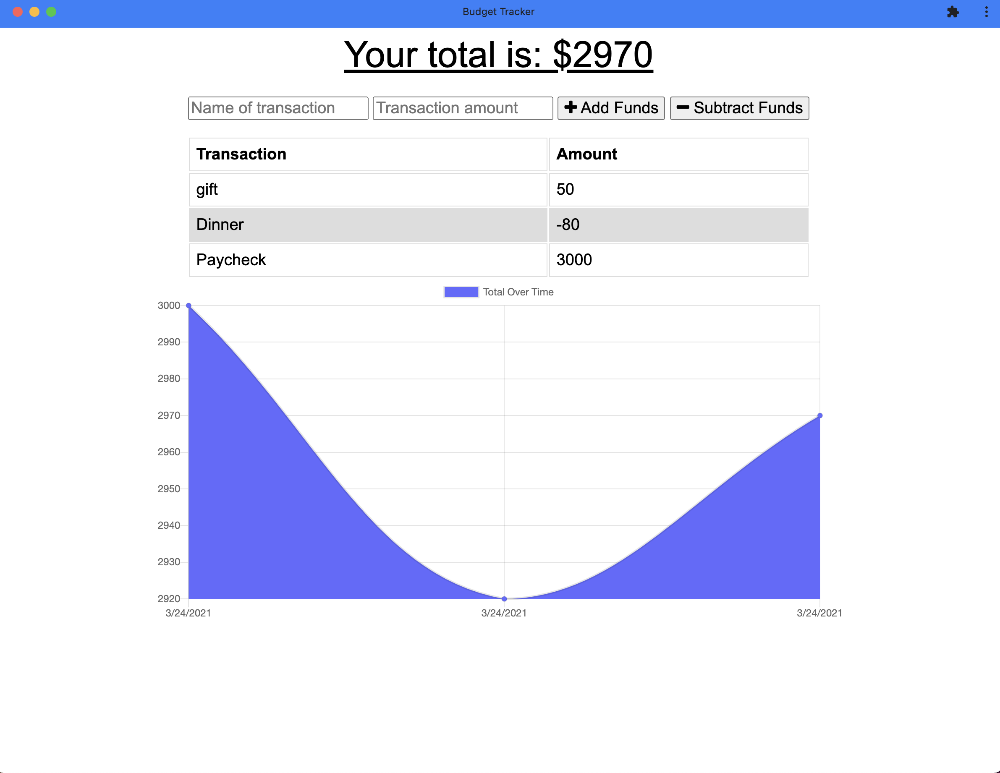

# Budget Tracker PWA
## Description
 Use this app to track income and expenses and chart them over time.  This app can be installed on your device and uses your browser's IndexedDB to save transactions while you are offline, which sync up when your app is connected again.
 
  [Link to Deployed Application](https://aqueous-mountain-13059.herokuapp.com)
  
  
  
  ## Table of Contents
  * [Installation](#installation)
  * [Languages and Technologies Used](#languages)
  * [Questions](#questions)
  
  ## Installation
 - assuming node and npm are installed. 

```shell
$ git clone git@github.com:sfunk11/budget-tracker.git
$ cd budget-tracker/
$ npm i
```
### Deploy to heroku
```shell
$ heroku create
$ git push heroku master
```

  ### Screenshots
  
  


  ## Languages and Technologies Used
  * HTML / CSS
  * Javascript (JQuery)
  * Database: MongoDB (Atlas DB)
  * Deployed to Heroku web service hosting
  * Node.js and packages:
    * Express
    * Mongoose
    * Morgan
    * Webpack
    * Compression

  
  ## Questions
  If you have any questions, please send them to me through GitHub or email.

  Github Username: sfunk11

  [borley1@gmail.com](mailto:borley1@gmail.com)

